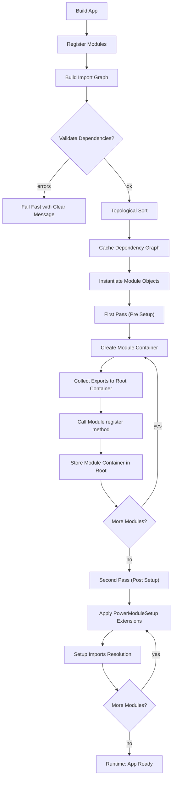

# Architecture Guide

> **💡 Recommended Reading:** This document provides a technical deep dive into the internal workings of the framework. To first understand the high-level principles and strategic goals that drive this architecture, please read our **[Architectural Vision Document](../ARCHITECTURAL_VISION.md)**.

Understanding the Modular Framework's core architectural principles.

## Core Philosophy

The Modular Framework is built on the principle of **explicit boundaries**. Each module:

- Owns its own dependency injection container
- Keeps services private by default
- Explicitly declares what it exports and imports
- Has clear, enforceable boundaries

## Module Encapsulation

### Private by Default
```php
class DatabaseModule implements PowerModule
{
    public function register(ConfigurableContainerInterface $container): void
    {
        // These services are PRIVATE to this module
        $container->set(ConnectionPool::class, ConnectionPool::class);
        $container->set(QueryLogger::class, QueryLogger::class);
        $container->set(DatabaseConnection::class, DatabaseConnection::class)
            ->addArguments([ConnectionPool::class, QueryLogger::class]);
    }
}
```

### Explicit Exports
```php
class DatabaseModule implements PowerModule, ExportsComponents
{
    public static function exports(): array
    {
        // Only these services are available to other modules
        return [
            DatabaseConnection::class,
            QueryBuilder::class,
        ];
    }

    public function register(ConfigurableContainerInterface $container): void
    {
        // Private services
        $container->set(ConnectionPool::class, ConnectionPool::class);
        $container->set(QueryLogger::class, QueryLogger::class);
        
        // Exported services
        $container->set(DatabaseConnection::class, DatabaseConnection::class)
            ->addArguments([ConnectionPool::class, QueryLogger::class]);
        $container->set(QueryBuilder::class, QueryBuilder::class)
            ->addArguments([DatabaseConnection::class]);
    }
}
```

## Import/Export System

### Declaring Dependencies
```php
class UserModule implements PowerModule, ImportsComponents
{
    public static function imports(): array
    {
        return [
            ImportItem::create(DatabaseModule::class, DatabaseConnection::class),
            ImportItem::create(LoggingModule::class, Logger::class),
        ];
    }

    public function register(ConfigurableContainerInterface $container): void
    {
        // Imported services are automatically available
        $container->set(UserRepository::class, UserRepository::class)
            ->addArguments([DatabaseConnection::class, Logger::class]);
    }
}
```

### Dependency Resolution

The framework automatically:
1. **Analyzes imports** to build a dependency graph
2. **Validates dependencies** - missing exports cause clear errors
3. **Sorts modules** topologically to ensure dependencies load first
4. **Caches the dependency graph** for fast subsequent boots

## Module Lifecycle

The framework follows a carefully orchestrated lifecycle to ensure proper module composition:

### 1. Dependency Resolution & Validation
- Build the import graph from `ImportsComponents` declarations (`ImportItem`)
- Topologically sort modules based on dependencies
- Validate: missing exports, cycles, or ambiguous items → fail fast with clear errors
- Cache dependency graph for faster subsequent boots

### 2. Module Instantiation
- Create actual PowerModule instances from class names (in sorted order)

### 3. First Pass - Module Registration (Setup Phase: Pre)
- For each module: create a dedicated container
- Collect exports from modules implementing `ExportsComponents` and register as aliases in root container
- Call module's `register()` method to define internal services
- Store module container in root container

### 4. Second Pass - Module Setup (Setup Phase: Post)
- Apply `PowerModuleSetup` extensions (e.g., imports resolution, routing setup)

### 5. Runtime Resolution
- `App::get()` resolves exported services from the root container
- Within a module, resolution stays local unless explicitly imported



### Key Lifecycle Principles

- **Two-pass registration**: First pass registers modules and exports, second pass handles imports and setup extensions
- **Encapsulation first**: No cross-module access without explicit import declarations
- **Deterministic composition**: Dependency sort + cache for speed and repeatability
- **Fail-fast validation**: Dependency issues are caught early during the sorting phase
- **Extension points** (`PowerModuleSetup`) enable cross-cutting features without leaking module boundaries

### Circular Dependency Detection
```php
// This would cause a CircularDependencyException
class ModuleA implements PowerModule, ImportsComponents {
    public static function imports(): array {
        return [ImportItem::create(ModuleB::class, ServiceB::class)];
    }
}

class ModuleB implements PowerModule, ImportsComponents {
    public static function imports(): array {
        return [ImportItem::create(ModuleA::class, ServiceA::class)]; // ❌ Circular!
    }
}
```

## Container Hierarchy

```
Root Container
├── Module A Container (private services)
├── Module B Container (private services) 
├── Module C Container (private services)
└── Exported Services (aliases to module containers)
    ├── ServiceA → Module A Container
    ├── ServiceB → Module B Container
    └── ServiceC → Module C Container
```

## Advanced Patterns

### Module Configuration
```php
class EmailModule implements PowerModule, HasConfig, ExportsComponents
{
    use HasConfigTrait;

    public function __construct()
    {
        $this->powerModuleConfig = Config::create();
    }

    public static function exports(): array
    {
        return [EmailService::class];
    }

    public function register(ConfigurableContainerInterface $container): void
    {
        $container->set(EmailService::class, EmailService::class)
            ->addArguments([
                $this->getConfigValue(Setting::SmtpHost),
                $this->getConfigValue(Setting::SmtpPort),
            ]);
    }
}
```

### Setup Extensions
```php
class CustomSetup implements CanSetupPowerModule
{
    public function setup(PowerModuleSetupDto $dto): void
    {
        if ($dto->setupPhase !== SetupPhase::Post) {
            return;
        }

        // Custom cross-cutting setup logic
        if ($dto->powerModule instanceof HasCustomBehavior) {
            // Configure custom behavior
        }
    }
}

// Add setup during app building (preferred)
$app = new ModularAppBuilder(__DIR__)
    ->withPowerSetup(new CustomSetup())
    ->build();

// Or add setup after building
$app->addPowerModuleSetup(new CustomSetup());
```

## Benefits

### **Team Scalability**
- Teams can own entire modules
- Clear interfaces prevent accidental coupling
- Independent development and testing

### **Architectural Clarity**  
- Explicit dependencies make system structure visible
- Easy to understand what depends on what
- Clear boundaries for refactoring

### **Testability**
- Each module can be tested in isolation
- Mock imports easily for unit testing
- Integration tests focus on module contracts

### **Microservice Preparation**
- Modules have clear boundaries
- Easy to extract modules into separate services
- Import/export contracts become API contracts