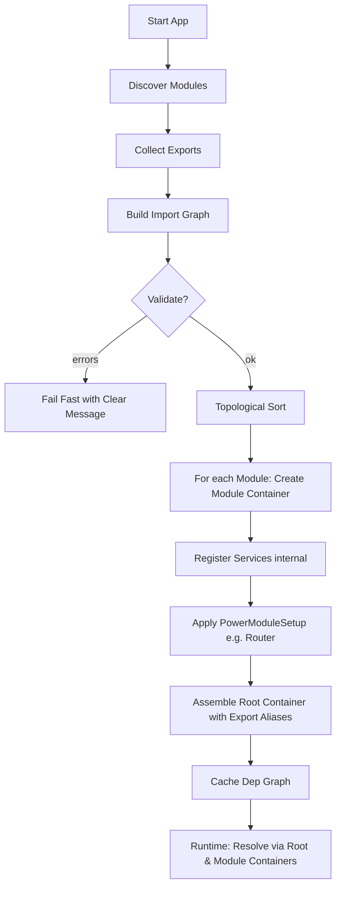

# Power Module Lifecycle

This document clarifies how the framework composes modules with explicit boundaries.

High-level phases
1) Discovery
   - Application identifies declared Power Modules and their configs.

2) Imports/Exports Resolution
   - Collect exports from modules implementing `ExportsComponents`.
   - Build the import graph from `ImportsComponents` declarations (`ImportItem`).
   - Topologically sort modules based on dependencies.
   - Validate: missing exports, cycles, or ambiguous items → fail fast with clear errors.

3) Module Container Build
   - For each module (in sorted order), create a dedicated container.
   - Register internal services (`ConfigurableContainerInterface::set()`).
   - Apply `PowerModuleSetup` extensions (e.g., routing setup).

4) Root Container Assembly
   - Compose a root container exposing exported services as aliases to their module containers.
   - Cache dependency graph for faster subsequent boots.

5) Runtime Resolution
   - `App::get()` resolves exported services from the root.
   - Within a module, resolution stays local unless explicitly imported.

Mermaid diagram

Notes
- Encapsulation first: no cross-module access without import.
- Deterministic composition: sort + cache for speed and repeatability.
- Extension points (`PowerModuleSetup`) enable cross-cutting features without leaking boundaries.