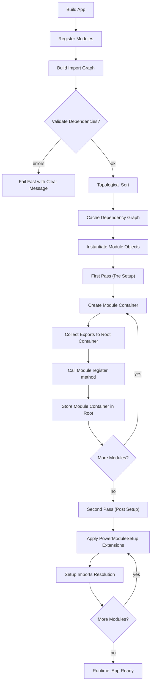

# Power Module Lifecycle

This document clarifies how the framework composes modules with explicit boundaries.

High-level phases
1) Dependency Resolution & Validation
   - Build the import graph from `ImportsComponents` declarations (`ImportItem`).
   - Topologically sort modules based on dependencies.
   - Validate: missing exports, cycles, or ambiguous items → fail fast with clear errors.
   - Cache dependency graph for faster subsequent boots.

2) Module Instantiation
   - Create actual PowerModule instances from class names (in sorted order).

3) First Pass - Module Registration (Setup Phase: Pre)
   - For each module: create a dedicated container.
   - Collect exports from modules implementing `ExportsComponents` and register as aliases in root container.
   - Call module's `register()` method to define internal services.
   - Store module container in root container.

4) Second Pass - Module Setup (Setup Phase: Post)
   - Apply `PowerModuleSetup` extensions (e.g., imports resolution, routing setup).

5) Runtime Resolution
   - `App::get()` resolves exported services from the root container.
   - Within a module, resolution stays local unless explicitly imported.

Mermaid diagram

Notes
- **Two-pass registration**: First pass registers modules and exports, second pass handles imports and setup extensions.
- **Encapsulation first**: no cross-module access without explicit import declarations.
- **Deterministic composition**: dependency sort + cache for speed and repeatability.
- **Fail-fast validation**: dependency issues are caught early during the sorting phase.
- **Extension points** (`PowerModuleSetup`) enable cross-cutting features without leaking module boundaries.